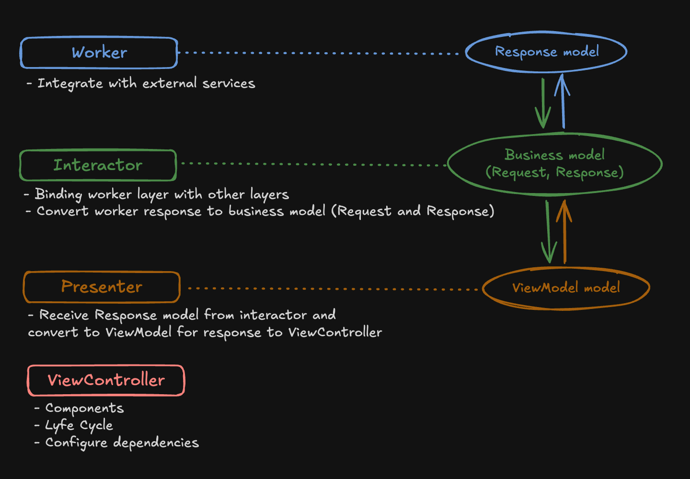

Buzz is a simple news app developed to explore the VIP (View, Interactor, Presenter) architecture. The app has two main screens:
	1.	A list of news articles.
	2.	A detail screen showing the full article.

## 🎯 Objective

The main goal of this project was to test the VIP architecture, clearly separating responsibilities across the UI, business logic, and data formatting layers.

## 🛠️ Architecture - VIP
- The project follows the VIP architecture, which organizes the code into three main layers:
	- The View requests actions from the Interactor.
	- The Interactor processes the data and notifies the Presenter.
	- The Presenter prepares the data and sends it back to the View.
 	- 

## 🚀 Features

-  News Listing:
	- Displays a list of news articles with title, date, and author.
- News Details:
	- Shows the full news article, including image, description, and content.

 ## 📂 Project Structure
 
```plaintext
Buzz/
├── Scenes/
│   ├── NewsList/
│   │   ├── NewsListView.swift
│   │   ├── NewsListInteractor.swift
│   │   ├── NewsListPresenter.swift
│   │   ├── NewsListRouter.swift
│   │   ├── NewsListModels.swift
│   ├── NewsDetails/
│       ├── NewsDetailsView.swift
│       ├── NewsDetailsInteractor.swift
│       ├── NewsDetailsPresenter.swift
│       ├── NewsDetailsRouter.swift
│       ├── NewsDetailsModels.swift
├── Resources/
│   ├── NetworkManager.swift
│   ├── APIClient.swift
│   ├── Models/
│       ├── News.swift
│       ├── ErrorResponse.swift
```

## 📦 Dependencies
- Kingfisher: For efficient image loading.

## 📸 App Demo

